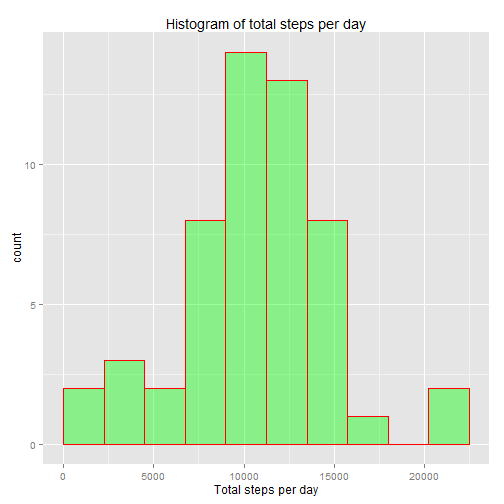
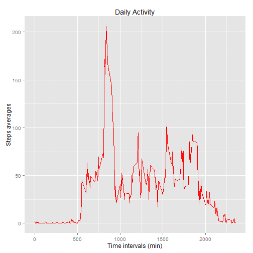
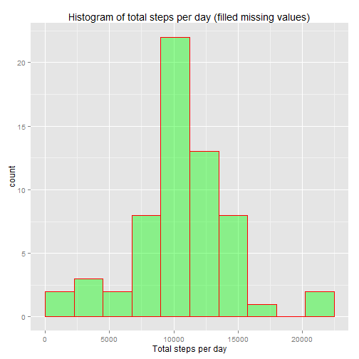
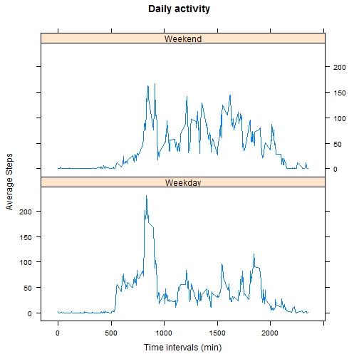

This file presents the solution of Project Assignment 1 for Reproducible Research class.

## Loading and preprocessing the data

The Assignment consists of analysing personal movement data from an anonymous person, stored in the file activity.csv. The data consists of measurements of number of steps taken at a five minute interval, for each day during two months. We load the data (and display the first rows) through the following R code:


```r
act<-read.csv('activity.csv')
head(act)
```

```
##   steps       date interval
## 1    NA 2012-10-01        0
## 2    NA 2012-10-01        5
## 3    NA 2012-10-01       10
## 4    NA 2012-10-01       15
## 5    NA 2012-10-01       20
## 6    NA 2012-10-01       25
```

The structure of the data can be also seen with the `str()` function:


```r
str(act)
```

```
## 'data.frame':	17568 obs. of  3 variables:
##  $ steps   : int  NA NA NA NA NA NA NA NA NA NA ...
##  $ date    : Factor w/ 61 levels "2012-10-01","2012-10-02",..: 1 1 1 1 1 1 1 1 1 1 ...
##  $ interval: int  0 5 10 15 20 25 30 35 40 45 ...
```

As we can see, the date column is of class factor, so in order to work with dates properly, we will assign it the appropriate class:


```r
act<-transform(act,date=as.Date(date,"%Y-%m-%d"))
```


## What is mean total number of steps taken per day?

Now, lets calculate the total number of steps taken on each day:


```r
totalsteps<-tapply(act$steps,act$date,sum)
head(totalsteps)
```

```
## 2012-10-01 2012-10-02 2012-10-03 2012-10-04 2012-10-05 2012-10-06 
##         NA        126      11352      12116      13294      15420
```

As we can see there are some days with missing values for total number of steps. This could mean two things. 

1) There are some NAs in that day which makes `sum()` gives NA. If this is true than it would be better to use `sum(...,na.rm=TRUE)` in order to ignore NAs.

2) All the data for that day is NA. If this is true instead, than we **shouldn't** use `sum(...,na.rm=TRUE)` because that would assign 0 steps for that day. As a consequence, we would not be ignoring NAs, but instead, we would be adding a lot of artificial zeroes in `totalsteps`.

We show in the following code that hypothesis **2** is the correct one, so that `totalsteps` we calculated is the appropriated one to ignore NAs. We will show that by calculating `totalsteps2` with `sum(...,na.rm=TRUE)`, and then comparing `is.na(totalsteps)` with `totalsteps2==0`, showing they are exactly the same, that is, NAs in `totalsteps` correctly account for days with no data:


```r
totalsteps2<-tapply(act$steps,act$date,sum,na.rm=TRUE)
sum(is.na(totalsteps)==(totalsteps2==0))
```

```
## [1] 61
```

61 is precisely the total number of days in the data, so that `totalsteps` correctly assigns NAs only to days with absolutely no data.

Below we plot the histogram of total number of steps per day:


```r
library(ggplot2)
ggplot(data=data.frame(totalsteps),aes(totalsteps))+
  geom_histogram(breaks=seq(0,22500,length.out=11),col='red',fill='green',alpha=0.4)+
  labs(x='Total steps per day',title='Histogram of total steps per day')
```

 

The statistics summary is shown below:


```r
summary(totalsteps)
```

```
##    Min. 1st Qu.  Median    Mean 3rd Qu.    Max.    NA's 
##      41    8841   10760   10770   13290   21190       8
```

The mean number of total steps per day is 10770, an median is 10760.

## What is the average daily activity pattern?

The following code calculates the average number of steps taken (averaged through all days), for each 5 minute interval. Note that in calculating the averages for this case we need to use `mean(...,na.rm=TRUE)` for ignoring the NAs. The code also plots the time series data:


```r
avgsteps<-tapply(act$steps,act$interval,mean,na.rm=TRUE,simplify=TRUE)
avgsteps<-data.frame(avgsteps,as.numeric(names(avgsteps)))
colnames(avgsteps)<-c('avgsteps','interval')

ggplot(data=avgsteps,aes(x=interval,y=avgsteps))+geom_line(col='red')+
  labs(x='Time intervals (min)',y='Steps averages',title='Daily Activity')
```

 

The plot above shows that the maximum average number of steps occurs somewhere between 750 and 1000 minutes. The exact time interval for the maximum is 835 minutes (calculated below):


```r
avgsteps$interval[max(avgsteps$avgsteps)==avgsteps$avgsteps]
```

```
## [1] 835
```

## Imputing missing values

The total number of missing values is 2304, as calculated below:


```r
sum(is.na(act$steps))
```

```
## [1] 2304
```

Next, we fill in the missing values by substituting them with the average number of steps in that time interval. The new data frame `actfill` is computed in the code below:


```r
nas<-is.na(act$steps) #logical vector locating NAs
ndays<-length(unique(act$date)) # total number of days
repavg<-rep(avgsteps$avgsteps,ndays) #repeats average number of steps vector 'ndays' times
actfill<-act # new data frame
actfill$steps[nas]<-repavg[nas] # fills in NAs
```

Similar to the first part of the assignment, the following code calculates the total number of steps per day with the filled in data, makes its histogram and calculates a statistics summary:


```r
totalstepsfill<-tapply(actfill$steps,actfill$date,sum)

ggplot(data=data.frame(totalstepsfill),aes(totalstepsfill))+
  geom_histogram(breaks=seq(0,22500,length.out=11),col='red',fill='green',alpha=0.4)+
  labs(x='Total steps per day',title='Histogram of total steps per day (filled missing values)')
```

 

```r
summary(totalstepsfill)
```

```
##    Min. 1st Qu.  Median    Mean 3rd Qu.    Max. 
##      41    9819   10770   10770   12810   21190
```

The mean is the same as before (10770), but the median changed from 10760 to 10770, equal to the mean.

As we added missign values based on the average number of steps present in the original data, the mean value for total steps per day couldn't change anyway. The changes observed were on the distribution of data. Median was brought closer to the mean (indeed they turned out to give identical values), resulting in a more symetric distribution, and more concentrated around the mean (as seen on the histogram).

## Are there differences in activity patterns between weekdays and weekends?

The following code creates a factor variable `daytype` which has levels "Weekday" and "Weekend". Levels are obtained by comparing `weekdays(actfill$date)` with the strings "Sunday" and "Saturday". A new data frame `actnew` is created including the factor variable:


```r
isweekend<-(weekdays(actfill$date)=="Sunday")|(weekdays(actfill$date)=="Saturday")
daytype<-character(nrow(actfill))
daytype[isweekend]<-"Weekend"
daytype[!isweekend]<-"Weekday"
daytype<-as.factor(daytype)
actnew<-data.frame(actfill,daytype)
head(actnew)
```

```
##       steps       date interval daytype
## 1 1.7169811 2012-10-01        0 Weekday
## 2 0.3396226 2012-10-01        5 Weekday
## 3 0.1320755 2012-10-01       10 Weekday
## 4 0.1509434 2012-10-01       15 Weekday
## 5 0.0754717 2012-10-01       20 Weekday
## 6 2.0943396 2012-10-01       25 Weekday
```

Next, `actnew` is split into two data frames according with the day type. The average number of steps is calculated through all weekdays (and weekends), for each time interval. The data is then reassembled in data frame `avgsteps2`, which has three variables: "AvgSteps", "Interval" and "DayType".


```r
actdaytype<-split(actnew,actnew$daytype)
stepsweekday<-tapply(actdaytype$Weekday$steps,actdaytype$Weekday$interval,mean)
stepsweekend<-tapply(actdaytype$Weekend$steps,actdaytype$Weekend$interval,mean)
n<-length(stepsweekday)
interval<-as.numeric(names(stepsweekday))
stepsweekday<-as.numeric(stepsweekday)
stepsweekend<-as.numeric(stepsweekend)

avgsteps2<-data.frame(c(stepsweekday,stepsweekend),rep(interval,2),rep(c("Weekday","Weekend"),each=n))
names(avgsteps2)<-c("AvgSteps","Interval","DayType")
head(avgsteps2)
```

```
##     AvgSteps Interval DayType
## 1 2.25115304        0 Weekday
## 2 0.44528302        5 Weekday
## 3 0.17316562       10 Weekday
## 4 0.19790356       15 Weekday
## 5 0.09895178       20 Weekday
## 6 1.59035639       25 Weekday
```

The following code makes the panel plot with daily activity for each day type:


```r
library(lattice)
xyplot(AvgSteps~Interval|DayType,data=avgsteps2,type='l',layout=c(1,2), xlab='Time intervals (min)', ylab='Average Steps',main='Daily activity')
```

 


